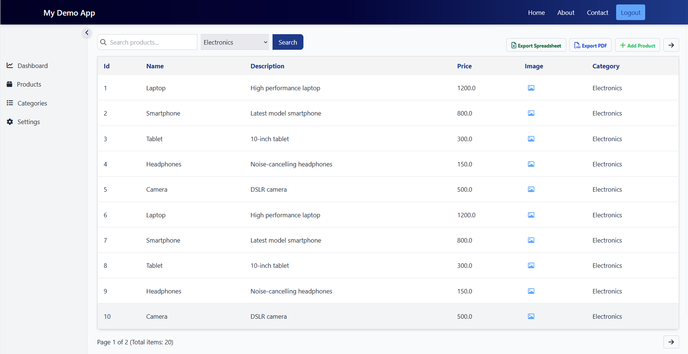
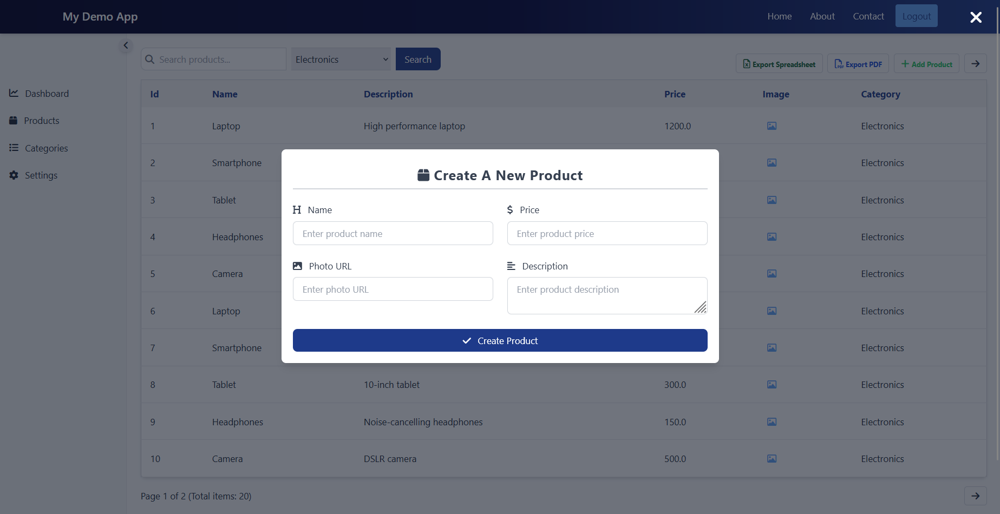
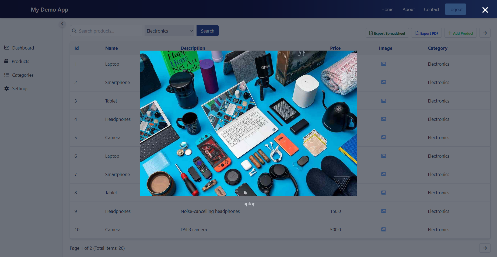

# Product Management Application

## Overview

The Product Management Application is a web-based platform designed to manage products efficiently. It provides features such as product listing, adding new products, viewing product details, and exporting data in various formats.

## Features

-   **Authentication**: Secure login and user management.
-   **View Products**: Display a list of products with details.
-   **View Categories**: Browse and manage product categories.
-   **Search Categories**: Search for specific categories.
-   **Filter Products**: Apply filters to narrow down product lists.
-   **Export Data**: Export product data to Excel and PDF formats.

## Screenshots

-   **List Products**:  
    
-   **Add Product Modal**:  
    
-   **View Product Image**:  
    

## Tech Stack

The application is built using the following technologies:

-   **Backend**: Spring Boot, Spring Data JPA
-   **Frontend**: Thymeleaf, HTMX, Tailwind CSS

## Getting Started

### Prerequisites

-   Java 21 or higher
-   Maven
-   H2 Database (default configuration)

### Installation

1. Clone the repository:
    ```bash
    git clone <repository-url>
    ```
2. Navigate to the project directory:
    ```bash
    cd start-beca
    ```
3. Build the project:
    ```bash
    mvn clean install
    ```
4. Run the application:
    ```bash
    mvn spring-boot:run
    ```

### Accessing the Application

-   Open your browser and navigate to `http://localhost:8080`.

## Feedback

For feedback or issues, please open an issue in the repository or contact the contributors.
